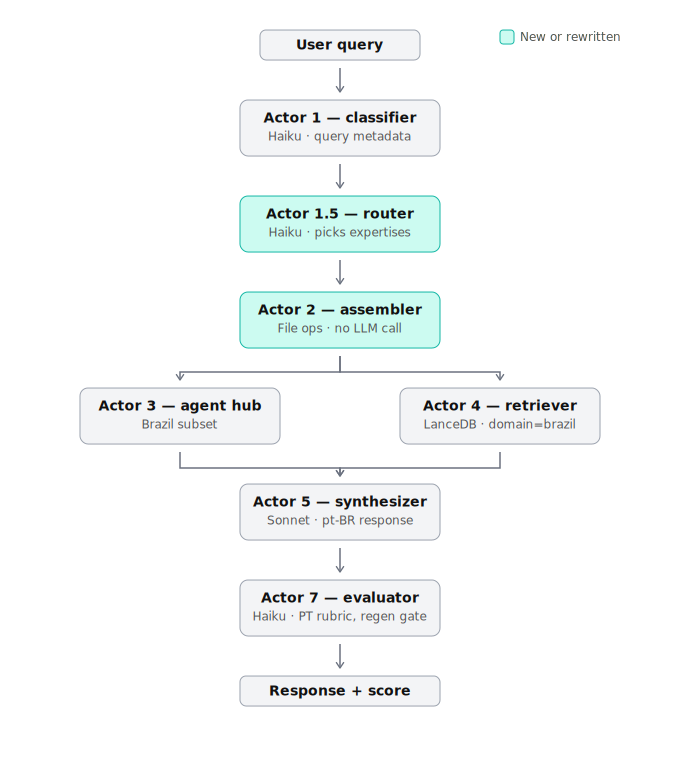
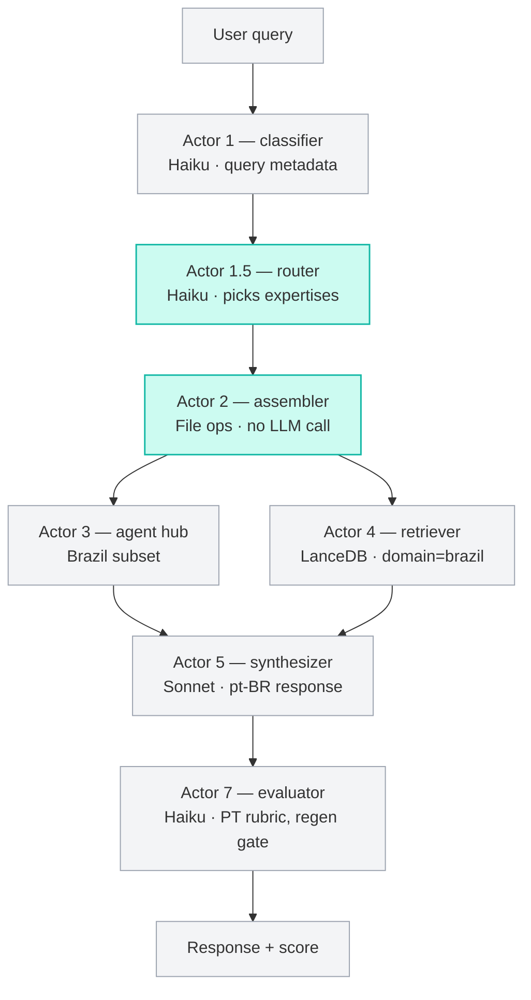
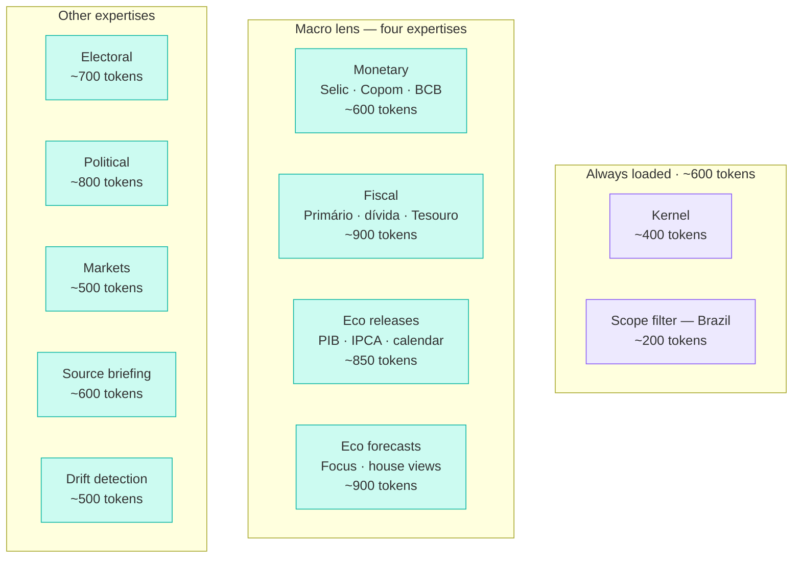

# m3xabr-core

> A reference implementation of expertise-composition architecture for a Brazilian intelligence agent.

`m3xabr-core` is a query infrastructure that answers Portuguese-language questions about Brazilian politics, economics, and markets by composing small expertise modules at query time, rather than loading a single large system prompt.

It's the stripped-down sibling of a live production agent — the architecture, expertise prompts, and orchestration code, without the deployment specifics. Clone it, point it at your own LanceDB corpus and API keys, and run it as a library, a CLI, or a service.

## What's interesting about it

Most RAG agents load a monolithic system prompt — every rule the system has ever needed, on every query. As the prompt grows, attention gets diluted, token budget gets eaten, and adding a new capability means editing a global file that already covers ten others.

**Expertise composition** flips this. A kernel holds identity and grounding rules. A `scope filter` bounds the corpus. Everything else — fiscal analysis, monetary policy, polling discipline, market conventions, drift detection — lives in **9 separate expertise files**. A cheap Haiku call routes each query to the 1-3 expertises that actually apply.

The result: per-query system prompt of **~2,300-6,000 tokens** depending on routing breadth (1-3 expertises loaded), vs ~6,800 for a static monolithic soul that always loads everything. The architecture is genuinely modular — adding a `commodity_analysis` expertise is one new file plus one line in the router prompt.

## The pipeline



Seven actors process a query in sequence. The two teal boxes (Router and Assembler) are what makes this architecture *expertise-composed* rather than monolithic. Everything else is standard RAG plumbing.



## The expertise pool



11 markdown files total. The router picks 1-3 conditional expertises per query, alongside the always-loaded kernel + scope filter. The Brazilian macro split (monetary / fiscal / economic releases / economic forecasts) reflects the actual analytical decomposition of the domain — Selic is monetary; primary deficit and debt are fiscal; IPCA-as-release is economic; house projections are forecasts.

## Quickstart

### Install

```bash
git clone https://github.com/prcodex/M3XABR_NEW.git
cd M3XABR_NEW
pip install -e ".[markets,dev]"
```

### Set API keys

```bash
export ANTHROPIC_API_KEY=sk-ant-...
export VOYAGE_API_KEY=pa-...
```

### Index a corpus

The pipeline expects a LanceDB table named `unified_feed` with columns `id`, `text`, `source`, `published_at`, `domain`, `content_vector`, `has_vector`. See [docs/SCHEMA.md](docs/SCHEMA.md) for the full schema. For a smoke test, the `examples/sample_corpus/` directory contains 8 stub documents you can ingest.

### Run a query

```bash
m3xabr query "Como está o IPCA?" --lancedb ./lancedb_data
m3xabr query "O Itaú revisou a projeção de Selic?" --debug
m3xabr expertises  # list available expertises
```

### Use as a library

```python
from m3xabr_core import Pipeline

pipeline = Pipeline(lancedb_path="./lancedb_data")
result = pipeline.run("O que o Goldman pensa sobre BRL?")

print(result.response)
print(f"Score: {result.score:.1f}/10.0")
print(f"Loaded: {result.routing_decision.expertises}")
print(f"System tokens: {result.estimated_system_tokens}")
```

## Repository layout

```
m3xabr-core/
├── README.md                    # this file
├── LICENSE                      # MIT
├── ARCHITECTURE.md              # the 7-actor pipeline in depth
├── pyproject.toml
├── config/
│   ├── classifier_prompt.md     # Actor 1 prompt
│   ├── router_prompt.md         # Actor 1.5 prompt
│   ├── evaluator_prompt.md      # Actor 7 prompt (Portuguese rubric)
│   └── retrieval_scoring.yaml   # Actor 4 weights + model config
├── expertises/                  # the 11 files
│   ├── m3xabr_kernel.md
│   ├── scope_filter_brazil.md
│   ├── monetary_analysis.md
│   ├── fiscal_analysis.md
│   ├── economic_releases.md
│   ├── economic_forecasts.md
│   ├── electoral_analysis.md
│   ├── political_analysis.md
│   ├── market_intelligence.md
│   ├── institutional_source_briefing.md
│   └── narrative_drift_detection.md
├── m3xabr_core/                 # the Python package
│   ├── pipeline.py              # orchestrator
│   ├── cli.py                   # CLI entrypoint
│   ├── schemas.py               # Pydantic actor contracts
│   ├── actors/                  # 7 actor implementations
│   └── backends/                # pluggable LLM / embedding / vector DB
├── docs/
│   ├── ROUTING_DECISIONS.md     # how the router disambiguates
│   └── diagrams/                # SVG + Mermaid source
├── tests/                       # routing + assembly + pipeline tests
└── examples/                    # sample queries + stub corpus
```

## Customization

**Swap the embedding provider.** Default is Voyage (multilingual, strong on Portuguese). Set `M3XABR_EMBEDDER=openai` and provide `OPENAI_API_KEY` to use OpenAI instead, or implement `EmbeddingBackend` for your provider of choice.

**Swap the vector DB.** Default is LanceDB. Implement `VectorDBBackend` (see `m3xabr_core/backends/vector_db.py`) for Qdrant, Weaviate, pgvector, Pinecone, anything with vector + metadata filter support.

**Add a custom expertise.** Drop a new `expertises/your_expertise.md` file with YAML frontmatter following the SKILL.md schema. Update `config/router_prompt.md` to include the description. No code changes needed — the assembler reads from the directory at startup.

**Add a custom data agent.** Subclass `DataAgent` in `m3xabr_core/actors/agent_hub.py` and pass to `AgentHub(agents=[...])`. The v0 ships with a working markets agent (yfinance) and stubs for polymarket, calendar, and boost.

**Tune the router's routing.** Edit the expertise `description` fields and the routing examples in `config/router_prompt.md`. The router is one Haiku call reading these — descriptions are the lever.

## How the router decides

See [docs/ROUTING_DECISIONS.md](docs/ROUTING_DECISIONS.md) for the disambiguation logic between adjacent expertises (e.g., monetary vs fiscal vs economic releases — what fires on "Itaú's view on Selic given fiscal pressure?").

## What this isn't

- **Not a framework.** It's a reference implementation. The Brazilian domain is hard-coded; the *architecture* is what generalizes. To build an expertise-composed agent for another domain (German energy markets, Greek politics, US tech), fork this and replace the `expertises/` directory.
- **Not a complete RAG system.** No ingestion pipeline. You bring your own corpus and indexer. The repo ships with a tiny stub corpus in `examples/sample_corpus/` for smoke tests only.
- **Not production-ready as deployed.** The retrieval scoring is simplified (vector + freshness only). The full M3xA production scoring (entity boost + source tier + M/G scores) is documented in `ARCHITECTURE.md` and implementable by extending the `Retriever` class.

## Architecture rationale

Long version in [ARCHITECTURE.md](ARCHITECTURE.md). Short version:

| | Monolithic soul | Expertise composition |
|---|---|---|
| Per-query system prompt | ~6,800 tokens (static) | ~2,300-6,000 tokens (dynamic by routing) |
| Adding a capability | Edit one growing file | Add one file |
| Routing | None | One Haiku call |
| Failure modes carried | Globally (every query) | By expertise (only when that expertise fires) |
| Attention dilution | High | Low |

The architectural bet: a router-driven dynamic composition is a strict improvement on a static system prompt for any agent with more than one analytical mode. Validate by A/B against monolithic on the same corpus; the evaluator (Actor 7) scores both and the comparison is empirical.

## License

MIT. See [LICENSE](LICENSE).

## Acknowledgements

Architecture inspired by [Anthropic's Skills standard](https://docs.claude.com/skills) — each expertise file is a SKILL.md with frontmatter the router reads to decide what loads. The standard was designed for tool selection; this is the same shape applied to prompt selection.
